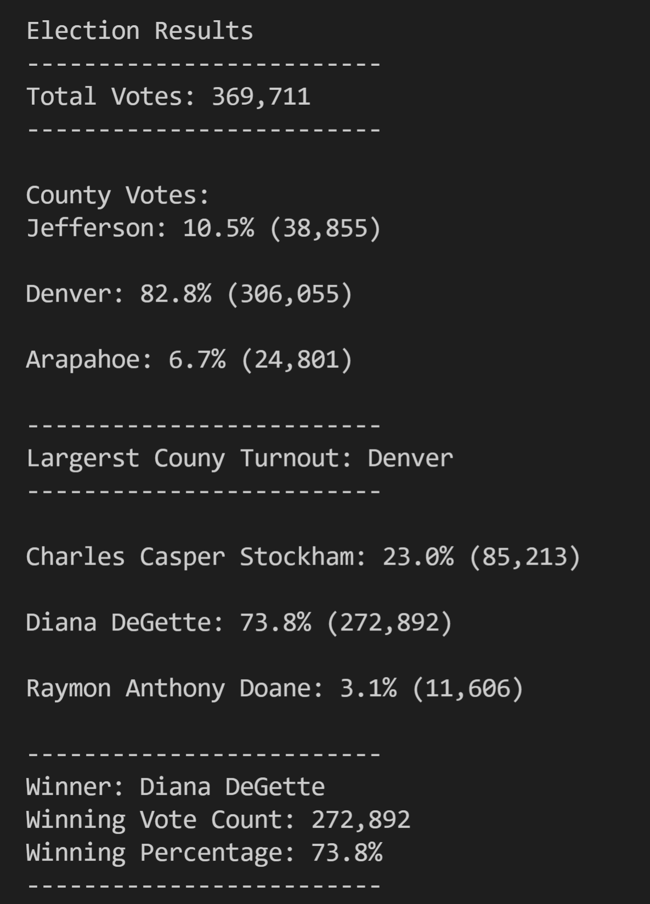

# Election Analysis

## Overview of Project
The record of the result of votes is given as a .csv file. The file should be analyzed in order to provide a detailed report about the vote.

### Purpose
To provide the detailed information about the total number of votes, candidates who received votes, number of votes each candidate received  and its percentages and identify the winner.

## Analysis and Challenges
Python will be used for creating a script that will allow us to extract all information that is requested.

### Performing python script.
During the analysis was created a script that runs through the .csv file and extract the data we need then performs mathematical procedures in order to provide final number

### Saving the result
All extracted information will be saved as a .txt file in order to be reachable for all.

### Challenges and Difficulties Encountered
The main challenge is that the code gets bigger and in the end some minor mistakes prevented it from running so I speeded some time on debugging.

## Results

According to the final file total number of votes is 369,711. The largest county turnover was in Denver: 82.8% (306,055) the other counties are Jefferson: 10.5% (38,855) and Arapahoe: 6.7% (24,801). The absolute winner of the election is Diana DeGette who received the main number of votes which is 73.8% and total number of votes 272,892 the other candidates are Charles Casper Stockham: 23.0% (85,213) and Raymon Anthony Doane: 3.1% (11,606)

## Summary
The final script can be used for future election audits and also, can be modified in order to expand or change its functionality. In order to load any other file with any name the line 9 should be changed instead of "election_results.csv" you can put any name you want, also if output file must be with their name just change the line 11 "election_result.txt". In addition, the same code can be used for city or federal elections or any other elections. In this case the county can be changed to city or state.
